# Knowledge Graph

```mermaid
graph TD
  Tank["Tank Entity"] --> Hull["Hull Mesh"]
  Tank --> Turret["Turret Group"]
  Turret --> Cannon["Cannon Pivot"]
  Tank --> Treads["Tread Meshes"]
  Tank --> CameraModes["Camera Modes"]
  CameraModes --> Driver["Driver View"]
  CameraModes --> Gunner["Gunner View"]
  CameraModes --> Commander["Commander View"]

  Terrain["Shader Terrain"] --> HeightFunc["getHeightAt()"]
  HeightFunc --> Collision["Grounding + Collision"]
  Terrain --> BiomeColors["Height Color Bands"]

  Lighting["Lighting System"] --> Sun["Directional Sun"]
  Lighting --> Ambient["Ambient + Hemisphere Light"]
  Lighting --> Skybox["Skybox Dome"]
  Skybox --> Fog["Scene Fog"]

  SVGTextures["SVG Textures"] --> HullTex["Hull Texture"]
  SVGTextures --> TurretTex["Turret Texture"]
  SVGTextures --> TreadTex["Tread Texture"]
  SVGTextures --> SkyTex["Skybox Texture"]
  SVGTextures --> PropTex["World Prop Textures"]

  Props["World Props"] --> Outposts["Outposts"]
  Props --> FuelDepots["Fuel Depots"]
  Props --> Beacons["Signal Beacons"]
  Props --> Rocks["Rock Clusters"]
  Props --> TerrainSnap["Terrain Height Snapping"]

  Input["Input System"] --> Drive["Drive Controls"]
  Input --> Aim["Turret + Cannon Aiming"]
  Aim --> Fire["Projectile Firing"]

  HUD["HUD + Mini-map"] --> CameraModes
  HUD --> Input
```

## Node Notes
- **Tank Entity** bundles meshes, camera tracking, and movement physics.
- **Shader Terrain** provides both visuals and the authoritative height data for collision.
- **SVG Textures** are generated from inline SVG strings to keep styling editable.
- **World Props** add SVG-textured structures that are grounded via terrain sampling.
- **HUD + Mini-map** communicate role changes and positional awareness.
- **Lighting System** bundles the skybox dome and sun/ambient lights to control scene mood.
