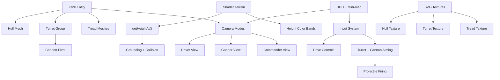

# Knowledge Graph

## Node Notes
- **Tank Entity** bundles meshes, camera tracking, and movement physics.
- **Shader Terrain** provides both visuals and the authoritative height data for collision.
- **SVG Textures** are generated from inline SVG strings to keep styling editable.
- **HUD + Mini-map** communicate role changes and positional awareness.
