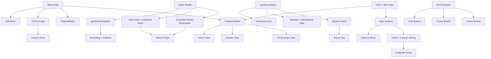

# Knowledge Graph

## Node Notes
- **Tank Entity** bundles meshes, camera tracking, and movement physics.
- **Voxel Terrain** provides both visuals and the authoritative height data for collision, with destructible updates.
- **SVG Textures** are generated from inline SVG strings to keep styling editable.
- **HUD + Mini-map** communicate role changes and positional awareness.
- **Lighting System** bundles the skybox shader and sun/ambient lights to control scene mood.
